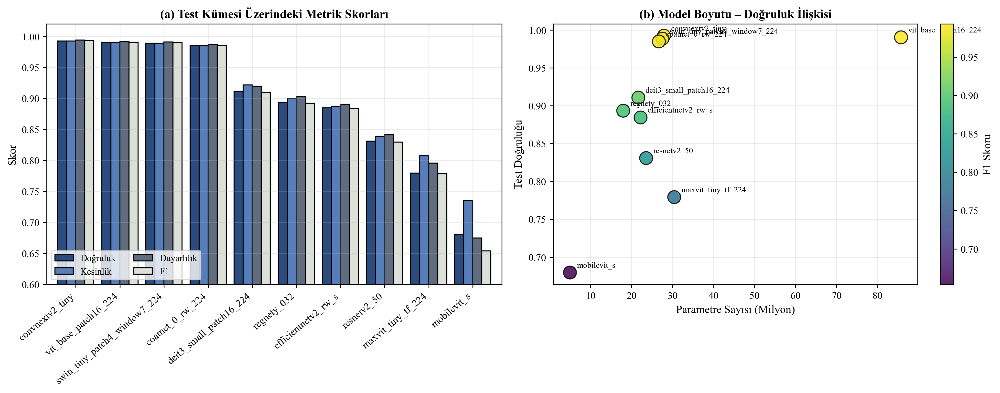
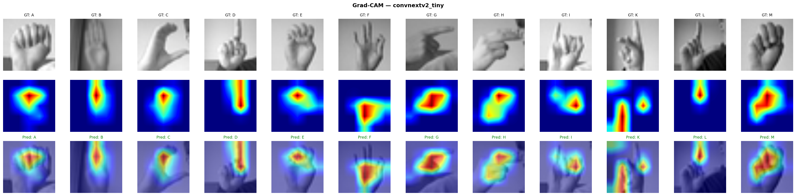

# Sign Language Recognition: Comparing 10 Transfer Learning Models

A benchmark of ten modern CNN and Vision Transformer backbones on **Sign Language MNIST** (American Sign Language alphabet, 24 static letters), all trained with the same recipe in PyTorch and `timm`.



## Results (test set, 7,172 images)

| Model | Type | Params | Accuracy | Macro F1 |
|---|---|---|---|---|
| **ConvNeXt-V2-Tiny** | CNN | 27.9 M | **99.25%** | **0.993** |
| ViT-Base/16 | Transformer | 85.7 M | 99.04% | 0.991 |
| Swin-Tiny | Transformer | 27.5 M | 98.87% | 0.990 |
| CoAtNet-0 | Hybrid | 26.7 M | 98.49% | 0.986 |
| DeiT-III-Small | Transformer | 21.7 M | 91.08% | 0.910 |
| RegNetY-032 | CNN | 18.0 M | 89.35% | 0.892 |
| EfficientNetV2-S | CNN | 22.2 M | 88.46% | 0.884 |
| ResNetV2-50 | CNN | 23.6 M | 83.09% | 0.830 |
| MaxViT-Tiny | Hybrid | 30.4 M | 77.93% | 0.778 |
| MobileViT-S | Mobile hybrid | 5.0 M | 67.97% | 0.654 |

The full table is in [`results/comparison.csv`](results/comparison.csv), with per-model metrics, training history, confusion matrices and Grad-CAM maps in `results/<model>/`.

## Training recipe

All models share the same two-phase transfer learning setup:

1. **Head training** (15 epochs): backbone frozen, only the classifier learns
2. **Fine-tuning** (15 epochs): the last 30 layers are unfrozen with a lower learning rate

Regularization and tricks: MixUp / CutMix, RandAugment, label smoothing, stochastic depth, cosine learning rate with linear warm-up, EMA weights and optional test-time augmentation. Images are upscaled from 28×28 to 160×160 and converted to 3 channels for the pretrained backbones.

## Explainability

Grad-CAM shows where the best model looks. For most letters the attention sits on the finger configuration that separates similar signs.



## Running

1. Download [Sign Language MNIST](https://www.kaggle.com/datasets/datamunge/sign-language-mnist) and put `sign_mnist_train.csv` and `sign_mnist_test.csv` in `data/`.
2. Install PyTorch for your CUDA version, then the rest:
   ```bash
   pip install torch torchvision --index-url https://download.pytorch.org/whl/cu121
   pip install -r requirements.txt
   ```
3. Train and compare:
   ```bash
   python main.py --model convnextv2_tiny      # one model
   python main.py --all                        # all ten models
   python main.py --gradcam                    # Grad-CAM for the best model
   python compare.py                           # comparison table and charts
   python paper_figures.py                     # publication figures
   ```
   For a quick check: `python main.py --model mobilevit_s --epochs-head 3 --epochs-finetune 3`

## Project structure

```
main.py             # CLI: train one or all models, Grad-CAM
compare.py          # Builds the comparison table and plots
paper_figures.py    # Figures and LaTeX table for the paper
src/
├── config.py       # Paths and hyperparameters
├── dataset.py      # CSV to tensor dataset and augmentations
├── models.py       # timm model factory and freezing logic
├── trainer.py      # Two-phase training loop, EMA, MixUp/CutMix
├── metrics.py
├── explain.py      # Grad-CAM
└── utils.py
results/            # Metrics, curves, confusion matrices (weights not included)
```
